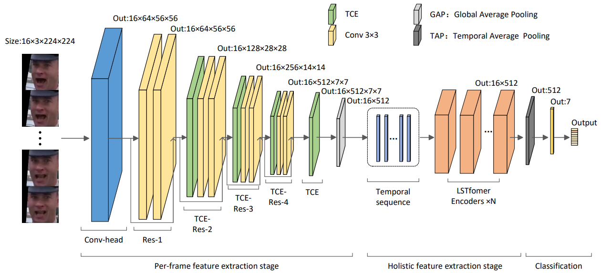
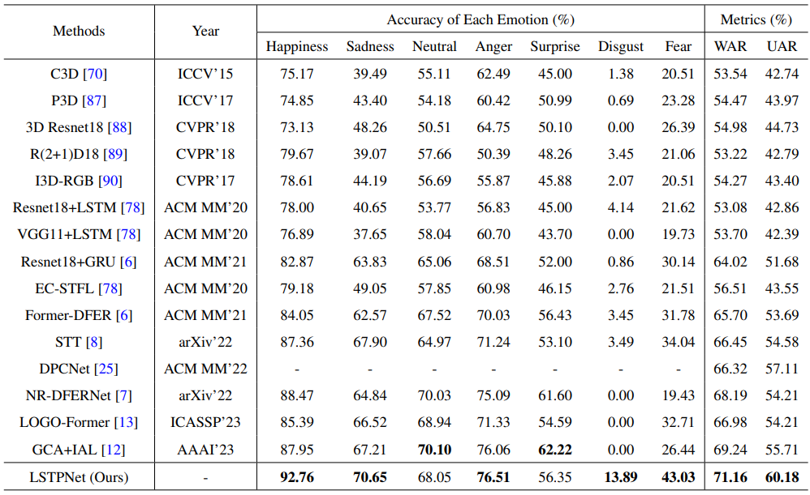
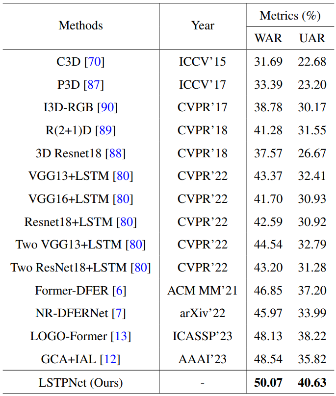
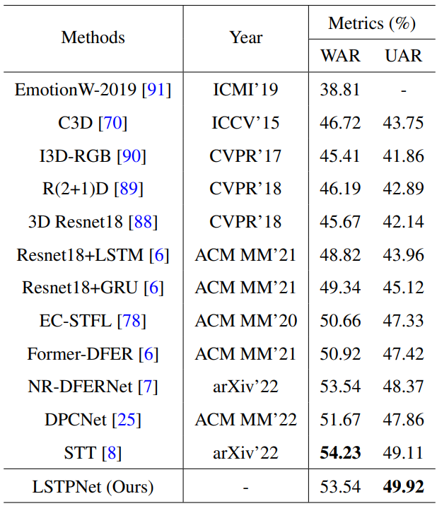

# LSTPNet
Official code repository for paper "LSTPNet: Long Short-Term Perception Network for Dynamic Facial Expression Recognition in the Wild".

## Overall Architecture

      
 <em> 
    Overall architecture of the proposed LSTPNet.
    </em>

## Test
Please download the pretrained model at [Google Driver](https://drive.google.com/drive/folders/1_nqZ21ZSd0RXY4f4auLt-1Qn4G4tIp4S?usp=drive_link).

Please run `python test_DFEW.py`, `python test_FERV39k.py`, `python test_AFEW.py`, respectively.

## Results

      
 <em> 
    Comparison with state-of-the-art methods on DFEW. The best results are highlighted in bold.
    </em>

      
 <em> 
    Comparison with state-of-the-art methods on FERV39k. The best results are highlighted in bold.
    </em>

      
 <em> 
    Comparison with state-of-the-art methods on AFEW. The best results are highlighted in bold.
    </em>

